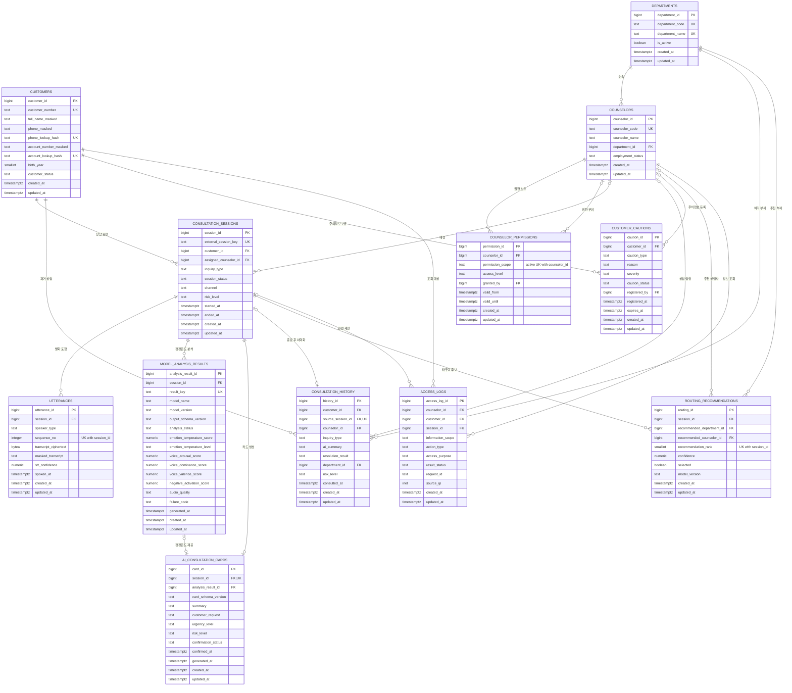

# K7 PostgreSQL ERD

> 참고용 12테이블 ERD입니다. 현재 MVP 활성 테이블은 `database/mvp/schema.sql`의 `calls`, `transcripts`, `consultation_cards` 세 개뿐입니다.

## 핵심 관계

- 고객 1명은 여러 상담 세션·과거 상담·주의정보·조회로그를 가질 수 있습니다.
- 상담 세션 1건은 여러 STT 발화·감정온도 결과·라우팅 후보를 가지며 상담카드는 최대 1건입니다.
- 상담카드는 같은 세션의 감정온도 결과만 복합 FK로 참조합니다.
- 세션이 종료되면 `consultation_history.source_session_id`로 원본 세션과 1:1 연결할 수 있습니다.
- 상담사 권한은 정보 범위별로 관리하고 실제 조회 결과는 `access_logs`에 불변 감사기록으로 남깁니다.
