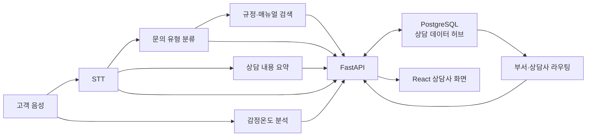

# K7 DB·데이터 통합 계약

## 1. 계약 목적과 적용 범위

이 문서는 STT·감정온도·문의 분류·RAG·상담카드·라우팅·React가 같은 상담 세션을 기준으로 데이터를 교환하기 위한 공통 계약입니다.

| 표준화 대상 | 이 문서가 정하는 기준 |
|---|---|
| 상담 식별 | `external_session_key`와 내부 `session_id` 연결 |
| 모델 출력 | JSON 필드·타입·버전·허용 점수 |
| 운영 저장 | 테이블·FK·저장 순서·트랜잭션 |
| 화면 응답 | 마스킹 필드·카드·라우팅·최근 상담 구조 |
| 운영 통제 | 권한 확인·조회로그·민감정보 금지 규칙 |

각 알고리즘, FastAPI API, React UI, 본인인증, 실제 금융 거래는 이 모듈에서 구현하지 않습니다.

## 2. 전체 구조



React와 AI 모델은 PostgreSQL에 직접 접속하지 않습니다. 입력 검증·마스킹·권한 확인·저장·조회는 FastAPI를 경유합니다.

## 3. 저장 위치

| 데이터 | 저장 위치 | 원칙 |
|---|---|---|
| 운영 상담 데이터 | PostgreSQL | 관계·무결성·조회가 필요한 데이터 |
| 팀 간 입력·출력 규격 | JSON Schema·OpenAPI | 전달값·API 검증 계약 |
| React 테스트 데이터 | 예제 JSON | 목업 후 동일 구조 API로 교체 |
| 음성 원본 | 파일시스템·객체 저장소 | PostgreSQL에 직접 저장하지 않음 |
| 모델 학습 데이터 | CSV·Parquet | 운영 DB와 분리 |
| 규정 원문·문서 | RAG·별도 문서 저장소 | DB에는 참조값만 저장 |
| 민감정보 원문 | 최소 저장·애플리케이션 암호화 | 일반 조회는 마스킹 값 사용 |

JSON은 운영 DB의 대체재가 아니라 계약·API 전달·테스트 형식입니다.

## 4. 공통 연결 기준

```json
{
  "external_session_key": "K7-DEMO-20260715-0001"
}
```

- `external_session_key`: 한 통화를 식별하는 1~100자의 불투명 팀 공통 키
- `session_id`: PostgreSQL 내부 `bigint` 키
- FastAPI가 외부 키를 내부 키로 변환
- URL 경로와 JSON 본문에 키가 함께 있으면 두 값이 같아야 하며 불일치는 `422`로 처리
- JSON·DB 필드명은 `snake_case`
- JSON 시간은 ISO 8601 UTC, DB 시간은 `timestamptz`
- 모델 JSON에는 고객 개인정보와 로컬 음성 파일 경로를 넣지 않음

## 5. P0·P1·제외 범위

| 구분 | 데이터 |
|---|---|
| P0 통합 데모 | 고객, 상담 세션, 마스킹 STT 발화, 감정온도, 문의 유형, 상담카드, 라우팅, 통합 조회, JSON 계약 |
| P1 운영 구조 | 과거 상담, 고객 주의정보, 상담사, 조회 권한, 개인정보 조회로그 |
| 제외 | 본인인증, 음성 원본 DB 저장, 방언·한숨·된소리 특징, 학습 특징, 실제 고객정보, 각 알고리즘 구현 |

P1은 별도 테이블로 준비하며 P0 카드 생성 흐름의 선행조건으로 만들지 않습니다.

## 6. 팀별 입출력 계약

### STT팀

입력 계약은 `contracts/stt_utterance_input.schema.json`, 마스킹 후 저장 계약은 `contracts/masked_utterance.schema.json`입니다.

백엔드에 다음 값을 전달합니다.

| 필드 | 형식 | 설명 |
|---|---|---|
| `external_session_key` | 문자열 | 공통 통화 키 |
| `sequence_no` | 1 이상의 정수 | 세션 내 발화 순번 |
| `speaker_type` | `customer` 등 | 화자 코드 |
| `transcript` | 문자열 | 마스킹 전 STT 결과; 백엔드 내부 처리용 |
| `stt_confidence` | 0~1 | STT 신뢰도 |
| `spoken_at` | ISO 8601 UTC | 발화 시각 |

백엔드가 개인정보를 마스킹한 뒤 `utterances.masked_transcript`에 저장합니다. 원문 저장이 필요하면 녹취 동의를 확인하고 애플리케이션/KMS 암호문과 키 버전을 함께 사용합니다.

### 감정 데이터팀

- 규격: `contracts/emotion_temperature_result.schema.json`
- 예시: `contracts/examples/emotion_temperature_result.example.json`
- 모델 저장소의 원시·중간 JSON은 직접 저장하지 않고 `contracts/model_adapter_guide.md`의 FastAPI 어댑터 경계를 거칩니다.
- 세그먼트별 원시 예측은 모델 측에 유지하고, DB에는 상담 단위로 집계·보정된 결과만 저장합니다.
- 보정되지 않은 zero-shot 원값은 `emotion_temperature_score`로 변환하지 않습니다.
- 같은 추론 결과의 재전송은 동일한 `result_key`를 사용합니다.
- `analysis_status=completed`일 때만 점수·등급이 존재합니다.
- 음성 부족·모델 장애는 `unavailable`·`failed`와 `failure_code`로 전달합니다.
- `stable`: 0~33, 화면 `안정`
- `caution`: 33 초과~66, 화면 `주의`
- `elevated`: 66 초과~100, 화면 `고조`
- 금지: 고객정보, STT 원문, 과거상담, 로컬 `audio_file` 경로

### 문의 분류·요약·RAG팀

- 입력: `external_session_key`, 마스킹된 발화
- 출력: 문의 유형 코드, 요약, 고객 요청, 위험 근거, 추천 조치, 규정 참조값
- 팀 간 모델 출력 필드명은 `snake_case`만 사용합니다. `businessType`, `incidentRisk`, `riskReasons`, `confidence` 같은 camelCase 모델 출력은 공식 API 계약으로 사용하지 않습니다.
- 현재 결합형 중간 출력은 `contracts/model_consultation_result_input.schema.json`으로 먼저 검증합니다.
- FastAPI 수신 경로는 `POST /api/v1/consultation-sessions/{external_session_key}/model-results`입니다.
- 결합형 입력의 요약·업무·위험 필드는 상담카드로, 부서·추천 이유는 라우팅 후보로 분리합니다.
- 위험정보가 없으면 저위험으로 간주하지 않고 업무 규칙의 보완 결과를 기다립니다.
- 출력 계약: `contracts/consultation_card.schema.json`
- 학습 데이터나 모델 저장소의 분류명을 직접 DB 코드로 사용하지 않고, 버전이 있는 어댑터 매핑을 통해 K7 문의 유형 코드로 변환합니다.
- 규정 원문은 RAG 저장소에 두고 카드에는 `related_manual_refs`만 저장합니다.

### 라우팅팀

- 입력: `external_session_key`, 문의 유형, 위험도·긴급도
- 출력: 추천 부서·상담사, 순위, 신뢰도, 근거, 선택 여부, 모델 버전
- 출력 계약: `contracts/routing_candidate.schema.json`
- 추천 결과는 `routing_recommendations`에 여러 후보로 저장하며 선택 결과는 세션당 최대 1건입니다.
- 상담사를 지정하면 해당 상담사가 추천 부서 소속이어야 합니다.

### 백엔드팀

- JSON Schema 또는 Pydantic으로 입력을 검증합니다.
- 현재 결합형 모델 결과는 `database.adapters.normalize_model_result` 참조 함수를 그대로 사용하거나 같은 규칙으로 구현할 수 있습니다.
- 전체 API 계약은 `contracts/openapi.yaml`을 기준으로 구현합니다.
- `external_session_key`를 `session_id`로 변환합니다.
- 문자열 조합이 아닌 바인딩 파라미터를 사용합니다.
- 권한 확인과 조회로그 기록은 같은 요청 흐름에서 처리합니다.
- React에 검색 해시·암호문·원문을 반환하지 않습니다.

### React팀

- `src/services/consultation.ts`가 `contracts/examples/consultation_card_response.example.json`을 기본 mock으로 사용합니다.
- `VITE_USE_REAL_DATA_API=true`이면 동일 구조의 FastAPI `GET` 호출로 전환됩니다.
- 응답은 `contracts/consultation_card_response.schema.json`으로 검증합니다.
- 화면의 해당 분석 항목은 `감정온도`로 표시합니다.
- 감정 단계는 API의 `label_ko`를 표시하며 자체 4단계 구간을 만들지 않습니다.
- 고객정보 조회 요청에는 `X-Access-Purpose`를 전달하며 백엔드는 성공·거부를 모두 기록합니다.
- DB 주소·SQL·비밀번호를 프론트 코드에 넣지 않습니다.

## 7. FastAPI 인터페이스 계약

API 구현이 아니라 백엔드팀과 합의한 데이터 경계입니다. 세부 요청·응답은 `contracts/openapi.yaml`을 단일 기준으로 사용합니다.

| 메서드·경로 | 용도 | 주요 테이블·SQL |
|---|---|---|
| `POST /api/v1/consultation-sessions` | 상담 세션 생성 | `consultation_sessions` |
| `POST /api/v1/consultation-sessions/{key}/utterances` | STT 발화 저장 | `utterances` |
| `POST /api/v1/consultation-sessions/{key}/emotion-temperature-results` | 감정온도 저장 | `model_analysis_results` |
| `PUT /api/v1/consultation-sessions/{key}/consultation-card` | 상담카드 저장·확인 | `ai_consultation_cards` |
| `GET /api/v1/consultation-sessions/{key}/consultation-card` | React 계약형 통합 카드 조회 | `get_consultation_card_response` |
| `PUT /api/v1/consultation-sessions/{key}/routing-candidates` | 라우팅 후보 저장·교체 | `routing_recommendations` |
| `POST /api/v1/consultation-sessions/{key}/complete` | 상담 종료·이력화 | `consultation_history` |
| `GET /api/v1/customers/{id}/consultation-history?limit=5` | 최근 상담 조회 | `get_recent_consultation_history` |
| `GET /api/v1/customers/{id}/cautions` | 주의정보 조회 | `get_customer_cautions` |
| `GET /api/v1/consultation-sessions/{key}/routing-results` | 라우팅 결과 조회 | `get_session_routing_results` |
| 내부 처리 | 조회로그 저장 | `insert_customer_access_log` |

정상 응답은 `{ "data": ... }`, 오류 응답은 다음 형식을 권장합니다.

```json
{
  "schema_version": "1.0",
  "error": {
    "code": "validation_error",
    "message": "입력 데이터가 계약과 일치하지 않습니다.",
    "request_id": "K7-REQ-0001",
    "details": []
  }
}
```

주요 상태 코드는 `200`, `201`, `403`, `404`, `409`, `422`, `503`입니다. 중복 세션 키는 `409`, JSON 계약 위반은 `422`로 처리합니다.

## 8. 저장 순서와 트랜잭션

1. `customers` 조회 또는 가상 고객 생성
2. `consultation_sessions`를 `unclassified`로 생성; `external_session_key` 중복 확인
3. `utterances` 저장; 세션별 `sequence_no` 중복 차단
4. JSON 검증 후 `result_key` 기준으로 `model_analysis_results` 멱등 저장
5. 문의 분류·요약·규정 참조를 `ai_consultation_cards`에 저장
6. `routing_recommendations` 후보와 선택 결과 저장
7. 권한 확인 후 통합 조회, 성공·거부 모두 `access_logs` 기록

세션 생성, 모델 결과 저장, 카드 저장, 라우팅 저장은 각각 짧은 트랜잭션으로 처리합니다. 상담카드는 `(analysis_result_id, session_id)` 복합 FK로 다른 세션의 모델 결과를 참조할 수 없습니다.

같은 세션 키·발화 순번·결과 키를 재전송했을 때 내용까지 같으면 기존 결과를 반환합니다. 같은 키의 내용이 다르면 자동 덮어쓰지 않고 `409 Conflict`를 반환합니다.

## 9. 와이어프레임 필드 매핑

| 화면 항목 | DB·조회 결과 | 비고 |
|---|---|---|
| 고객 마스킹 정보 | `customers.full_name_masked`, `phone_masked`, `account_number_masked` | 해시·암호문 노출 금지 |
| 고객 주의정보 | 통합 조회의 `customer_cautions` | 현재 유효한 유형·사유·심각도·등록일·만료일 |
| 문의 유형 | `consultation_sessions.inquiry_type` | 영문 코드→한글 라벨 매핑 |
| 문의 요약 | `ai_consultation_cards.summary` | 카드 모델 결과 |
| 감정온도 | `model_analysis_results.emotion_temperature_score`, `emotion_temperature_level` | 안정·주의·고조 |
| 위험도·긴급도 | 카드의 `risk_level`, `urgency_level` | `low`~`critical` |
| 추천 조치 | `recommended_actions`, `suggested_opening` | 상담사 참고 정보 |
| 관련 규정 | `related_manual_refs` | RAG 원문 식별자 |
| 최근 상담내역 | 통합 조회의 `recent_consultations` 또는 `get_recent_consultation_history` | P1, 최대 5건 |
| 라우팅 결과 | `get_session_routing_results` | 부서·상담사·신뢰도·근거 |
| 마스킹 발화 | 통합 조회의 `masked_utterances` | React에 원문 미제공 |

시연 화면 [K7 라이브 상담 프로토타입](https://k7product.vercel.app/)의 준비 카드는 이 계약의 `summary`, `customer_request`, `risk_factors`·`confirmation_items`, `routing_result`, `related_manual_refs`를 사용합니다. 본인확인·보유상품 조회는 외부 금융 시스템 영역이며 이 DB에 저장하지 않습니다.

| 프로토타입 상태 | DB `session_status` |
|---|---|
| `idle`, `connecting` | `waiting` |
| `recording`, `confirm` | `analyzing` |
| `prep` | `ready` |
| `active` | `in_progress` |
| `summarizing` | `summarizing` |
| `wrap` | `wrap_up` |
| 후처리 저장 완료 | `completed` |

## 10. 개인정보와 감사로그

- 실제 금융 고객정보를 seed·예제에 사용하지 않습니다.
- 일반 조회는 마스킹 고객정보와 `masked_transcript`만 사용합니다.
- 녹취 미동의 세션은 마스킹 발화만 저장하고 암호화 원문 저장도 차단합니다.
- 전화·계좌 검색은 운영에서 서버 비밀키 기반 HMAC을 사용합니다.
- React 응답에는 검색 해시·암호문·키 버전을 포함하지 않습니다.
- `access_logs`에는 조회자·시각·대상 고객·정보 범위·목적·결과만 기록합니다.
- 로그에 고객정보 원문이나 발화 원문을 쓰지 않습니다.
- 감사로그의 UPDATE·DELETE는 DB 트리거가 차단합니다.
- DB 제약조건은 FastAPI의 인증·인가를 대신하지 않습니다.

## 11. 운영 전 확정할 항목

- STT 원문 저장 여부와 음성·발화 보존기간
- RAG 규정 참조 ID와 부서 코드의 최종 형식
- 상담사 카드 수정 이력과 메모·VOC 저장 범위
- Railway 운영 백업·복구와 비밀키 관리 정책
