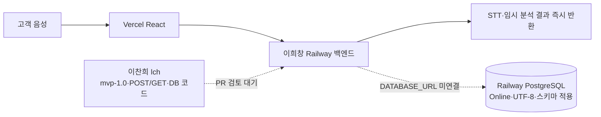
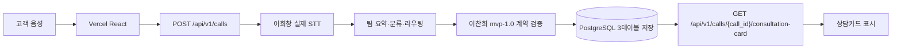

# K7 MVP 통합 현황 — 2026-07-16

## 결론

이찬희 담당 범위인 `mvp-1.0` 데이터 계약, PostgreSQL 3테이블, FastAPI 저장·조회 경계, React 음성 업로드 연결은 `lch` 브랜치에 구현됐습니다.

실제 한국어 WAV로 `STT → 구조화 → PostgreSQL 저장 → call_id 재조회`를 Railway 검증 서비스에서 통과했고, 별도의 PostgreSQL 통합 테스트도 UTF-8 왕복 저장을 확인한 뒤 테스트 행을 자동 삭제합니다.

최종 운영 연결은 이희창 백엔드 저장소 소유자가 `lch`의 계약·DB 경계를 운영 FastAPI에 통합하고, Vercel 소유자가 배포 권한을 승인해야 완료됩니다. 이찬희 작업에서는 이희창 운영 서비스를 수정하지 않습니다.

## 현재 팀 전체 구조



현재 운영 백엔드의 GitHub Source에는 `HeeChang50/kda4-k7-backend`와 `GitHub Repo not found`가 표시됩니다. `pollmap` 계정에서도 저장소가 404이므로 저장소 소유자 또는 Railway GitHub App 권한 확인이 필요합니다.

## 목표 완성 구조



## 단계별 현재 상태

| 단계 | 현재 증거 | 상태 | 최종 담당 작업 |
|---|---|---:|---|
| 고객 음성 입력 | React `audio/*` 업로드 구현 | 완료 | Vercel 운영 API 주소 적용 |
| STT | 실제 한국어 WAV가 정확한 한국어 텍스트로 변환됨 | 검증 완료 | 이희창 STT 유지 |
| 요약·분류·라우팅 | MVP 구조화 결과 동작 | 임시 로직 | 전형진·김설빈 로직으로 교체 |
| 표준화 | JSON Schema·Pydantic·TypeScript `mvp-1.0` 일치 | 완료 | 계약 변경은 PR로만 관리 |
| PostgreSQL | Railway Online, UTF-8, 3테이블 자동 생성, CRUD 통과 | 완료 | 운영 FastAPI에 참조 연결 |
| 저장 API | `POST /api/v1/calls` 201 및 call_id 반환 | 검증 완료 | 이희창 백엔드에 통합 |
| 조회 API | 같은 call_id로 GET 200, POST와 동일한 카드 | 검증 완료 | 이희창 백엔드에 통합 |
| 감정 | 가짜 점수 없이 `unavailable` | MVP 완료 | 실제 모델 수령 후 함수 교체 |
| Vercel | React 빌드 통과, Vercel 팀 권한으로 배포 차단 | 외부 승인 필요 | Vercel 소유자가 `pollmap` 초대 또는 직접 배포 |

## Railway 검증 결과

- PostgreSQL 서비스: `Postgres` (`71973777-1539-462e-b29b-7675afdb6b96`)
- 서버 인코딩: `UTF8`
- 활성 테이블: `calls`, `transcripts`, `consultation_cards`
- 실제 음성 검증 call_id: `26749b14-e912-4fe3-a7d0-d6877bdc65e6`
- 실제 STT: `안녕하세요. 주택담보대출 만기가 다음 달인데 연장이 가능한지 그리고 필요한 서류가 무엇인지 알고 싶습니다.`
- 분류 결과: `대출 및 금융상담`, 위험도 `low`
- POST 결과와 GET 재조회 결과 동일
- 합성 음성 테스트 행 3개 정리 완료
- 자동 PostgreSQL 통합 테스트는 임시 행을 `finally`에서 삭제

검증용 `k7-mvp-lch-preview`는 공개 도메인과 `DATABASE_URL`·OpenAI·CORS 변수를 모두 제거했습니다. 현재 계정에는 서비스 삭제 권한이 없어 빈 서비스 껍데기 삭제만 Railway 관리자가 수행해야 합니다.

## 이찬희 담당 완료 범위

1. 음성 전용 `mvp-1.0` 표준 JSON과 enum
2. 모델 출력 → 표준 계약 경계
3. PostgreSQL 최소 3테이블과 자동 스키마 적용
4. FastAPI 저장·조회 API
5. React 타입·서비스 호출 경계
6. 기존 9개 API의 호환 경로
7. 계약·어댑터·FastAPI·DB·UTF-8·음성 E2E 검증
8. Railway Python 모노레포 빌드 설정

## 검증 명령

일반 CI:

```powershell
npm run check
.\.venv\Scripts\python.exe -m pytest backend\tests -q
```

실제 PostgreSQL 왕복 테스트:

```powershell
$env:K7_TEST_DATABASE_URL = "postgresql://테스트용-DB-URL"
.\.venv\Scripts\python.exe -m pytest backend\tests\test_database_integration.py -q
Remove-Item Env:K7_TEST_DATABASE_URL
```

실제 음성 E2E:

```powershell
powershell.exe -NoProfile -ExecutionPolicy Bypass `
  -File .\scripts\smoke-mvp.ps1 `
  -AudioPath .\samples\customer.wav `
  -ApiBaseUrl https://운영-Railway-백엔드
```

## 남은 팀 작업

1. 이희창: 백엔드 저장소/Railway GitHub App 접근 복구
2. 이희창: `lch`의 계약·DB·POST/GET 경계를 운영 FastAPI에 통합
3. 이희창: 운영 서비스에 `DATABASE_URL=${{Postgres.DATABASE_URL}}` 참조 설정
4. 전형진·김설빈: 임시 요약·감정·분류·라우팅 함수를 실제 로직으로 교체
5. 김민기: 실제 규정 파일과 RAG·브리핑카드 조립 연결
6. Vercel 소유자: `pollmap` 팀 접근 승인 또는 권한 있는 계정으로 배포
7. Railway 관리자: 연결 해제된 `k7-mvp-lch-preview` 빈 서비스 삭제

## PR 상태

- PR: `lch → main` #1
- 최신 검증 기준: 현재 `lch` HEAD의 PostgreSQL 통합 테스트·현황 문서 포함
- GitHub CI: React·계약·FastAPI·DB 계약 통과
- 병합 가능 상태
- Vercel 실패 원인: 코드가 아니라 Git 작성자의 Vercel 팀 접근 권한
