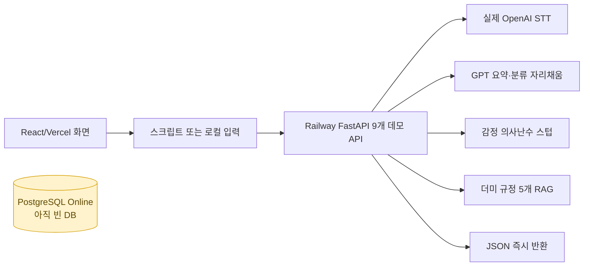
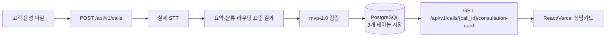

# K7 MVP 통합 현황 — 2026-07-16

## 결론

현재 공개 데모는 화면과 Railway 파이프라인 골격이 동작하지만, PostgreSQL 저장·재조회까지 연결된 완성형 E2E는 아직 아닙니다.

`lch`에는 이를 해결하기 위한 비마스킹 `mvp-1.0` 단일 계약, FastAPI, PostgreSQL 3테이블, 실제 음성 파일 업로드 코드가 통합됐습니다. 로컬 검증은 통과했으며 GitHub 병합·Railway 재배포·Vercel 연결이 남았습니다.

## 현재 공개 상태

핵심 문제는 API 응답 후 결과가 DB에 남지 않아 `call_id`로 다시 조회할 수 없다는 점입니다.

## 목표 MVP

## 단계별 현황

| 단계 | 현재 자산 | 실제 완료 판단 | 다음 완료조건 |
|---|---|---:|---|
| 상담사 UI | React 화면, 이관·규정검색·메모·후처리 반영 | 높음 | 새 API 응답으로 실제 카드 표시 |
| 고객 음성 입력 | `실제 음성 파일` 업로드 코드 추가 | 코드 완료·미배포 | Vercel에서 WAV 업로드 성공 |
| STT | 이희창 Railway의 OpenAI Whisper 호출 존재 | 동작 골격 완료 | 업로드 음성이 실제 한국어 텍스트로 반환 |
| 요약 | GPT 구조화 출력 자리채움 | MVP 대체 가능 | 전형진·김설빈 로직 수령 또는 GPT를 MVP 공식안으로 승인 |
| 카테고리·라우팅 | 부서 taxonomy·prompt·검증 코드 존재 | 로직 교체 대기 | 표준 7필드 출력과 시나리오 테스트 |
| 감정 | 데이터 파이프라인·실버500·라벨 UI는 존재 | 운영 모델 미완료 | MVP에서는 `unavailable`; 모델 도착 후 함수 교체 |
| RAG | 더미 규정 5개와 UI 검색 영역 존재 | 자리채움 | 김민기의 실제 규정 파일·검색 코드 연결 |
| 표준화 | `mvp-1.0` JSON Schema·Pydantic·TS 타입 | 로컬 완료 | 팀 승인·PR 병합 |
| PostgreSQL | Railway 서비스 Online, 3테이블 SQL 완료 | 빈 DB | `DATABASE_URL` 연결 후 자동 생성·행 저장 확인 |
| 상담카드 조회 API | POST/GET 구현·테스트 완료 | 로컬 완료 | Railway 배포 후 201/200 확인 |
| 공개 E2E | 기존 즉시응답 데모만 가능 | 미완료 | Vercel 음성→DB→조회 한 번에 성공 |

## 이찬희 담당 범위

### 직접 책임

1. `mvp-1.0` 표준 JSON과 enum 관리
2. 모델별 출력이 표준 JSON으로 들어오는 어댑터 경계 관리
3. PostgreSQL 최소 스키마와 `DATABASE_URL` 연결
4. FastAPI 저장·조회 계약과 React 타입 일치 확인
5. 계약·DB·E2E 테스트와 통합 현황 문서화

### 직접 만들 필요가 없는 것

- STT 모델 또는 음성 API 자체
- 감정 모델 학습
- 요약 LLM 연구
- 실제 규정 문서 수집·RAG 품질
- 상담사 화면 디자인 전체

이찬희의 역할은 각 기능을 하나로 연결하고, 어떤 팀 결과도 같은 계약과 DB에 들어가게 만드는 프로젝트의 척추입니다.

## 최신 팀 요청 기준 남은 일

| 담당 | 확인된 현재 자산 | 이번 MVP에 줄 산출물 |
|---|---|---|
| 이희창 | Railway FastAPI, 실제 STT, 기존 9개 API, 전체 조립 | `lch` 표준 백엔드 검토·배포, 기존 API 호환 확인 |
| 전형진·김설빈 | 담당 확정, 최종 코드 미수령 | `text -> 표준 7필드` Python 함수, 감정 함수, 판단 규칙과 예제 |
| 김민기 | React 기반과 최신 UX 요구, RAG 담당 | 실제 규정 파일, 검색 함수, 카드 추천 조치 조립 코드 |
| 박정운 | 모델링 저장소에 데이터 프로파일·실버500·라벨링 도구 존재, Slack에서는 UI 방향 확인 요청 | UI 소유권 확정; 감정 자산을 쓸 경우 배포 가능 함수와 모델 파일 전달 |
| 이찬희 | DB·계약·통합 코드 | PR·Railway DB 연결·E2E 증거 |

업무분장 문서의 이름별 최종 분장은 과거에는 미확정이었으므로, 위 표는 2026-07-16 Slack의 최신 요청을 우선합니다.

## 모델링 자산의 정확한 의미

- WAV 14,606개·약 23.55시간 프로파일링 자산이 있습니다.
- 125개 원본의 clean/전화품질 250건 zero-shot 실험이 있습니다.
- 실버 예측 500개와 개발 후보 442개가 있습니다.
- 사람 평가 패키지는 준비됐지만 평가 완료율 문서상 0/1,500이며 `INCOMPLETE`입니다.
- 모델카드는 현재 결과를 미보정·shadow-only로 제한합니다.

따라서 감정 연구 자산은 상당하지만, Railway에서 호출할 수 있는 검증된 감정 모델은 아직 없다고 판단합니다.

## 배포 전 완료 체크

- [x] 음성 전용 활성 계약
- [x] 비마스킹 MVP 3테이블 SQL
- [x] FastAPI POST 저장·GET 조회 구현
- [x] 기존 Railway 9개 경로 호환 보존
- [x] React 실제 음성 파일 업로드 연결
- [x] JSON·React·FastAPI 로컬 테스트
- [ ] GitHub PR 검토·병합
- [ ] Railway 백엔드를 GitHub 소스에 연결
- [ ] 백엔드 `DATABASE_URL`을 Postgres 참조로 설정
- [ ] Railway에서 테이블 3개 생성 확인
- [ ] 실제 샘플 음성으로 POST 201 확인
- [ ] 같은 `call_id` GET 200·동일 JSON 확인
- [ ] Vercel 환경변수 설정·재배포
- [ ] 브라우저에서 상담카드 표시 확인
