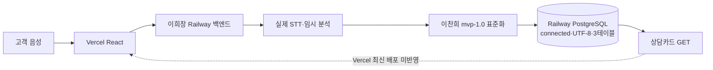
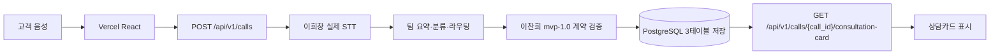

# K7 MVP 통합 현황 — 2026-07-16

## 결론

이찬희 담당 범위인 `mvp-1.0` 데이터 계약, 활성 자산 매니페스트, 모델 결과 어댑터, PostgreSQL 3테이블, FastAPI 저장·조회 경계, React 음성 업로드 연결은 `lch` 브랜치에 구현됐습니다.

실제 한국어 WAV로 `STT → 구조화 → PostgreSQL 저장 → call_id 재조회`를 Railway 검증 서비스에서 통과했고, 별도의 PostgreSQL 통합 테스트도 형진 모델 원시 4필드 → 어댑터 → UTF-8 왕복 저장을 확인한 뒤 테스트 행을 자동 삭제합니다.

이희창 운영 FastAPI에는 `lch`의 계약·DB 경계가 반영됐고 Railway `DATABASE_URL`도 연결됐습니다. 남은 핵심은 실제 STT가 반환하는 부동소수점 시간을 DB 정밀도와 동일하게 정규화하고, Vercel 소유자가 자기 계정으로 최신 통합 API를 화면에 연결하는 것입니다. 유료 Vercel 팀 권한 공유는 요구하지 않습니다.

## 현재 팀 전체 구조



현재 운영 백엔드의 GitHub Source에는 `HeeChang50/kda4-k7-backend`와 `GitHub Repo not found`가 표시됩니다. `pollmap` 계정에서도 저장소가 404이므로 저장소 소유자 또는 Railway GitHub App 권한 확인이 필요합니다.

2026-07-16 최신 공개 상태 확인에서 운영 API는 기존 8개 POST 경로와 새 `/api/v1/calls`, 상담카드 GET, `/health`를 합쳐 11개 경로를 제공합니다. `/health`는 `database=connected`, `contract_version=mvp-1.0`을 반환하며 `scripts/check-production-readiness.ps1` 결과는 `ready=true`입니다.

실제 한국어 WAV도 운영 POST 201과 GET 200까지 성공했습니다. 상담 데이터는 동일했지만 STT의 이진 부동소수점 `duration_sec=10.100000381469727`이 PostgreSQL `numeric(10,3)` 저장 후 `10.1`로 조회되는 정밀도 차이를 발견했습니다. `lch` 통합 서비스에서 저장 전에 소수점 셋째 자리로 정규화하여 POST와 GET이 처음부터 같은 계약 값을 사용하도록 수정합니다.

## 목표 완성 구조



## 단계별 현재 상태

| 단계 | 현재 증거 | 상태 | 최종 담당 작업 |
|---|---|---:|---|
| 고객 음성 입력 | React `audio/*` 업로드 구현 | 완료 | Vercel 운영 API 주소 적용 |
| STT | 실제 한국어 WAV가 정확한 한국어 텍스트로 변환됨 | 검증 완료 | 이희창 STT 유지 |
| 요약·분류·라우팅 | MVP 구조화 결과 동작 | 임시 로직 | 전형진·김설빈 로직으로 교체 |
| 표준화 | JSON Schema·Pydantic·TypeScript `mvp-1.0` 일치 | 완료 | 계약 변경은 PR로만 관리 |
| 활성 자산 통제 | 매니페스트가 버전·파일·3테이블·음성·비마스킹 정책 검증 | 완료 | `active-manifest.json` 변경은 PR 필수 |
| 모델 어댑터 | canonical 결과와 형진 모델 `summary/task_category/consulting_situation/qa_topic`을 모두 표준화 | 완료 | 실제 전체 라벨 목록으로 후처리 규칙 확인 |
| PostgreSQL | Railway Online, UTF-8, 3테이블, 운영 `database=connected` | 운영 완료 | 참조 변수 유지 |
| 저장 API | 운영 `POST /api/v1/calls` 201 및 call_id 반환 | 운영 완료 | 시간 정밀도 수정 반영 |
| 조회 API | 같은 call_id로 운영 GET 200, 카드 내용 동일 | 보완 중 | `duration_sec` 3자리 정규화 |
| 감정 | 가짜 점수 없이 `unavailable` | MVP 완료 | 실제 모델 수령 후 함수 교체 |
| Vercel | React 빌드 통과, 팀 공유는 유료라 사용하지 않음 | 소유자 작업 필요 | Vercel 소유자가 환경변수와 배포를 직접 반영 |

## Railway 검증 결과

- PostgreSQL 서비스: `Postgres` (`71973777-1539-462e-b29b-7675afdb6b96`)
- 서버 인코딩: `UTF8`
- 활성 테이블: `calls`, `transcripts`, `consultation_cards`
- 실제 음성 검증 call_id: `26749b14-e912-4fe3-a7d0-d6877bdc65e6`
- 실제 STT: `안녕하세요. 주택담보대출 만기가 다음 달인데 연장이 가능한지 그리고 필요한 서류가 무엇인지 알고 싶습니다.`
- 분류 결과: `대출 및 금융상담`, 위험도 `low`
- POST 결과와 GET 재조회 결과 동일
- 합성 음성 테스트 행 3개 정리 완료
- 자동 PostgreSQL 통합 테스트는 임시 행을 `finally`에서 삭제
- 형진 모델 원시 `summary/task_category/consulting_situation/qa_topic` → 표준 카드 → 실제 DB 재조회 통과
- 2026-07-16 노출 가능성이 있던 PostgreSQL 비밀번호 회전 완료
- 회전 후 새 자격증명 연결, UTF8, 활성 3테이블, 데이터 0건 유지 확인
- 운영 백엔드에는 회전된 값을 복사하지 않고 `DATABASE_URL=${{Postgres.DATABASE_URL}}` 참조만 사용해야 함
- 운영 Railway deployment `09fe8b9c-ba9f-4f65-b503-95d84f4e2aa0` 상태 `SUCCESS`
- 운영 readiness `true`: 새 POST/GET, DB, 계약 버전, 기존 8개 POST 경로 확인
- 실제 음성 운영 POST 201·GET 200 성공
- 운영 검증으로 생성된 `k7-mvp-test-call.wav` 행 2건 삭제, 현재 calls 0건
- 감정온도 정책 확정: 고객 음성만 입력, 텍스트 감정은 활성 결과로 금지
- 현재 음성 처리 방식 확정: 완성 음성 파일 일괄 처리, 실시간 전화망·스트리밍 아님
- 통합 함수가 실제 감정 결과에 `emotion_source="audio"`를 요구하도록 코드 강제
- 어댑터 성격 확정: 비-AI 결정론적 Python 매핑·검증 코드

검증용 `k7-mvp-lch-preview`는 공개 도메인과 `DATABASE_URL`·OpenAI·CORS 변수를 모두 제거했습니다. 운영 통합 확인 후 Railway 관리자가 빈 서비스 껍데기를 삭제하면 됩니다. 기술적 의존성은 없어서 지금 삭제해도 운영에는 영향이 없습니다.

## 이찬희 담당 완료 범위

1. 음성 전용 `mvp-1.0` 표준 JSON과 enum
2. 모델 출력 → 표준 계약 경계
3. PostgreSQL 최소 3테이블과 자동 스키마 적용
4. FastAPI 저장·조회 API
5. React 타입·서비스 호출 경계
6. 기존 9개 API의 호환 경로
7. 계약·어댑터·FastAPI·DB·UTF-8·음성 E2E 검증
8. Railway Python 모노레포 빌드 설정
9. 활성·참고 자산 구분과 CI 매니페스트 검증
10. 이희창·Claude용 운영 통합 인계 프롬프트

## 검증 명령

일반 CI:

```powershell
npm run check
.\.venv\Scripts\python.exe -m pytest backend\tests -q
```

실제 PostgreSQL 왕복 테스트:

```powershell
$env:K7_TEST_DATABASE_URL = "postgresql://테스트용-DB-URL"
.\.venv\Scripts\python.exe -m pytest backend\tests\test_database_integration.py -q
Remove-Item Env:K7_TEST_DATABASE_URL
```

실제 음성 E2E:

```powershell
powershell.exe -NoProfile -ExecutionPolicy Bypass `
  -File .\scripts\smoke-mvp.ps1 `
  -AudioPath .\samples\customer.wav `
  -ApiBaseUrl https://운영-Railway-백엔드
```

## 남은 팀 작업

1. 이희창: `HeeChang50/kda4-k7-backend` PR #1을 이찬희가 실제 diff 검토할 수 있도록 저장소 읽기 권한 부여 또는 patch 제공
2. 이희창: 검토 반영 후 PR #1을 운영 `main`에 머지
3. 이희창: 운영 서비스에 `DATABASE_URL=${{Postgres.DATABASE_URL}}` 참조 설정. 회전 전 복사한 DB URL은 사용 금지
4. 전형진: 금융 모델 서버 URL·인증·정상/오류 JSON·세 분류축 전체 라벨 목록 제공
5. 이희창: Railway에서 접근 가능한 형진 모델 서버 경로를 기존 STT 뒤에 연결
6. 김민기: 실제 규정 파일과 RAG·브리핑카드 조립 연결
7. Vercel 소유자: 유료 팀 공유 없이 자기 계정에서 운영 API 환경변수와 배포 반영
8. Railway 관리자: 연결 해제된 `k7-mvp-lch-preview` 빈 서비스 삭제

## PR 상태

- PR: `lch → main` #1
- 최신 검증 기준: 현재 `lch` HEAD의 PostgreSQL 통합 테스트·현황 문서 포함
- GitHub CI: React·계약·FastAPI·DB 계약 통과
- 병합 가능 상태
- Vercel 자동 체크 차단 원인: 코드가 아니라 유료 팀 공유를 사용하지 않아 Git 작성자에게 프로젝트 권한이 없음. 소유자가 직접 배포
