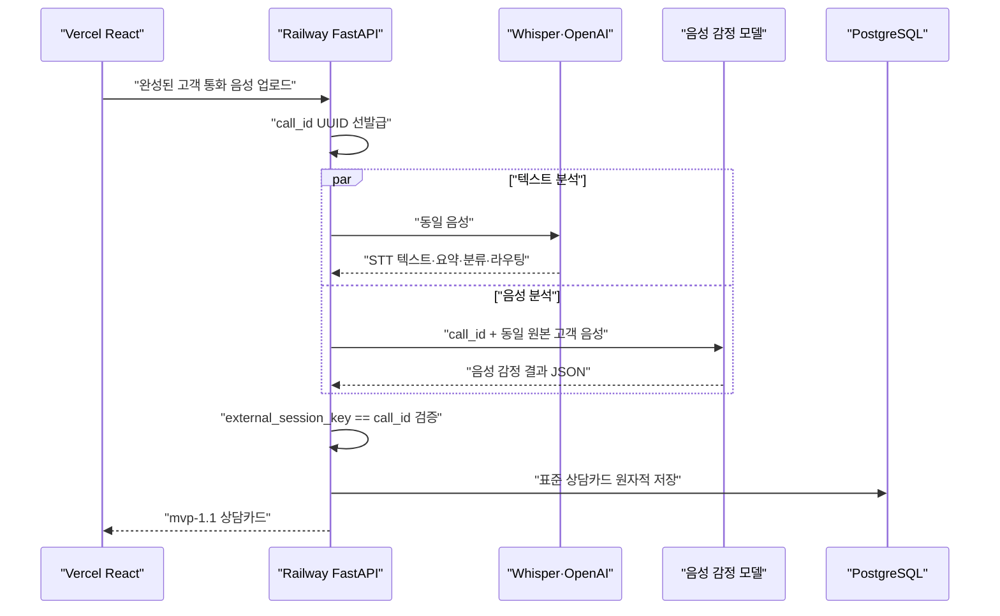

# K7 음성 감정 모델 인수 요청서

## 목적

이 문서는 음성 감정 모델 담당자가 모델 서버를 제공하고, 이희창 운영 FastAPI가 같은 고객 통화 음성을 전달해 `mvp-1.1` 상담카드에 결합하기 위한 최소 계약입니다.

음성 감정 모델은 PostgreSQL, React, STT, OpenAI를 직접 호출하지 않습니다. 입력 음성과 `call_id`를 받아 음성 특징 기반 결과 JSON만 반환하면 됩니다.

## 확정 처리 흐름



## 모델 서버가 제공할 것

1. Railway 운영 백엔드에서 접근 가능한 HTTPS URL
2. 인증 방식
   - 인증 없음, 또는
   - `Authorization: Bearer <token>`처럼 서버 간 호출이 가능한 방식
3. 지원 음성 확장자와 최대 파일 크기
4. 정상 응답 JSON 한 건
5. 분석 불가·실패 응답 JSON 한 건
6. 모델 이름과 버전
7. 평균 처리 시간과 타임아웃 권장값

토큰이나 비밀번호는 Slack, GitHub, 응답 본문에 쓰지 않고 Railway 비밀 환경변수로만 전달합니다.

## 권장 HTTP 요청

경로 이름은 모델 서버가 정할 수 있지만, 요청 의미는 아래와 같아야 합니다.

```http
POST <AUDIO_EMOTION_MODEL_URL>
Content-Type: multipart/form-data
Authorization: Bearer <optional-token>

call_id=<FastAPI가 먼저 만든 UUID>
audio=<같은 고객 통화 음성 파일>
```

필드:

| 필드 | 필수 | 의미 |
|---|---:|---|
| `call_id` | 예 | FastAPI가 STT·모델 호출 전에 만든 UUID |
| `audio` | 예 | STT에 사용한 것과 동일한 고객 통화 음성 |

STT 텍스트, 키워드, 요약문을 음성 감정 입력으로 대체하면 안 됩니다.

## 정상 응답

응답은 `database/contracts/emotion_temperature_result.schema.json`을 통과해야 합니다.

```json
{
  "schema_version": "1.0",
  "external_session_key": "94650acb-f213-49ee-a94e-87dfd645cc40",
  "result_key": "K7-EMOTION-0001",
  "model_name": "team-audio-emotion",
  "model_version": "0.1.0",
  "analysis_status": "completed",
  "emotion_temperature_score": 74,
  "emotion_temperature_level": "elevated",
  "voice_arousal_score": 70,
  "voice_dominance_score": 58,
  "voice_valence_score": 28,
  "negative_activation_score": 50.4,
  "audio_quality": "normal",
  "failure_code": null,
  "generated_at": "2026-07-16T08:00:00Z"
}
```

필수 규칙:

- `external_session_key`는 요청의 `call_id`와 정확히 같아야 합니다.
- 점수는 0 이상 100 이하입니다.
- `0..33=stable`, `33 초과..66=caution`, `66 초과..100=elevated`입니다.
- `completed`일 때 점수와 단계는 필수이며 `failure_code`는 `null`입니다.
- `generated_at`에는 `Z` 또는 UTC 오프셋이 있어야 합니다.
- 모델이 생성하지 않은 임의의 기본 점수를 넣지 않습니다.

## 분석 불가·실패 응답

음질이 나쁘거나 모델 호출이 실패하면 가짜 점수 대신 아래처럼 반환합니다.

```json
{
  "schema_version": "1.0",
  "external_session_key": "94650acb-f213-49ee-a94e-87dfd645cc40",
  "result_key": "K7-EMOTION-0002",
  "model_name": "team-audio-emotion",
  "model_version": "0.1.0",
  "analysis_status": "unavailable",
  "emotion_temperature_score": null,
  "emotion_temperature_level": null,
  "voice_arousal_score": null,
  "voice_dominance_score": null,
  "voice_valence_score": null,
  "negative_activation_score": null,
  "audio_quality": "too_short",
  "failure_code": "AUDIO_TOO_SHORT",
  "generated_at": "2026-07-16T08:00:01Z"
}
```

`analysis_status=failed | unavailable`이면 모든 점수와 단계는 `null`이고 `failure_code`는 필수입니다. K7 어댑터는 이 응답을 상담카드의 `emotion.status=unavailable`로 변환합니다.

## 통합 모듈이 자동으로 하는 일

음성 모델 담당자는 다음을 구현하지 않아도 됩니다.

- PostgreSQL 테이블 생성 또는 접속
- `mvp-1.1` 전체 상담카드 조립
- React 화면 변경
- STT 또는 OpenAI 호출
- 업무 분류·부서 라우팅

이찬희 통합 모듈이 다음을 처리합니다.

1. 응답 JSON 스키마 검증
2. `external_session_key == call_id` 검증
3. 점수와 단계 구간 검증
4. 실패 응답의 가짜 점수 차단
5. 표준 `EmotionResult` 변환
6. 원시 모델 결과를 `raw_emotion_result JSONB`로 추적 저장
7. 텍스트 분석 결과와 같은 `call_id`로 결합

## 인수 테스트

| 시험 | 기대 결과 |
|---|---|
| 정상 고객 음성 | `completed`, 유효한 점수·단계 |
| 너무 짧은 음성 | 점수 없이 `unavailable`과 `failure_code` |
| 다른 `call_id` 응답 | 통합 모듈이 저장 거절 |
| `74 + stable` 응답 | 점수–단계 불일치로 거절 |
| 점수가 있는 실패 응답 | 가짜 점수로 판단해 거절 |
| 텍스트만 모델에 전달 | 음성 감정 모델 인수 실패 |

## Slack에 보낼 메시지

```text
[K7 음성 감정 모델 연동 요청]

모델 서버에서는 고객 음성과 call_id를 받아 음성 특징 기반 감정 결과 JSON만 반환해주시면 됩니다. STT·DB·React·전체 상담카드 조립은 통합 파트에서 처리합니다.

필요한 것:
1. Railway에서 접근 가능한 HTTPS URL
2. 인증 방식
3. 지원 음성 형식·최대 크기
4. 정상 응답 JSON
5. 분석 불가/실패 응답 JSON
6. 모델명·버전·평균 처리시간

입력:
- call_id: FastAPI가 분석 전에 만든 UUID
- audio: STT에 사용한 것과 동일한 고객 통화 음성

출력 계약:
database/contracts/emotion_temperature_result.schema.json

중요:
- external_session_key는 요청 call_id와 같아야 함
- 실제 음성만 분석하고 STT 텍스트로 대체하지 않음
- 실패 시 임의 점수를 만들지 않고 점수 null + failure_code 반환
- 토큰은 Slack/GitHub에 올리지 않고 Railway 비밀 환경변수로 전달

전체 예시와 검수표는 docs/AUDIO_EMOTION_MODEL_HANDOFF.md에 있습니다.
```
